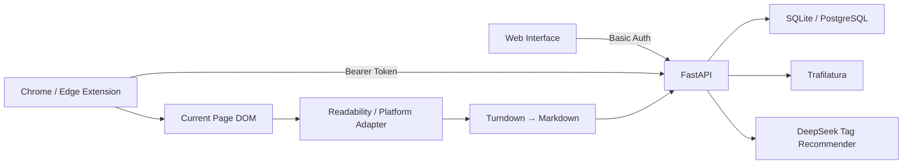

<div align="center">

# 🔖 URL Bookmark

**Save more than a URL — preserve the content that was actually worth keeping.**

A lightweight personal web bookmarking and archiving tool with both a **Web interface** and a **Chrome / Edge extension**.

[简体中文](./README.md) | [English](./README.en.md)

[Online Demo](https://url-bookmark.onrender.com) | [AI Collaboration Notes](./AI_NOTES.md)

</div>

---

## Overview

URL Bookmark started with a simple goal: paste a URL, save its title and main content, and make it easy to find again through tags and search.

Real-world pages make that harder than it sounds. Some sites reject server requests, JavaScript applications return an empty HTML shell, and authenticated content may be visible to the user but unavailable to the backend. Even when extraction fails, the user still needs to keep the URL.

The project therefore separates three responsibilities:

```text
Extension = Capture
Web       = Organize
Backend   = Store + Extract
```

> **A Bookmark is the primary record. Markdown is an enhancement. Extraction failure must never mean bookmark loss.**

## Core Features

### Bookmarking

- Save a URL from the Web interface;
- Extract the page title and main content as Markdown;
- Represent extraction with `success`, `fetch_failed`, and `extract_failed` states;
- Preserve the URL, title, tags, and notes when fetching or extraction fails;
- Retry server extraction later;
- Detect duplicate URLs before fetching and update the existing bookmark's tags or notes instead of creating another copy.

### Browser Extension

The Chrome / Edge Manifest V3 extension provides:

- automatic capture when the popup opens;
- on-demand page access through `activeTab + scripting`;
- extraction from the already rendered browser DOM;
- Mozilla Readability and Turndown Markdown conversion;
- support for JavaScript-rendered and authenticated pages already visible to the user;
- URL-only fallback when no main content is found;
- a shared multi-select tag experience and optional notes;
- the three most recent bookmarks with Web links and soft delete;
- `Cmd/Ctrl + Shift + S` quick-save to `Inbox`.

### Tags and AI Assistance

- Reuse existing tags;
- Create a tag from the first row of the shared multi-select menu;
- Generate DeepSeek suggestions from the title and Markdown;
- Prefer the existing taxonomy before proposing a small number of new tags;
- Keep suggestions unselected until the user explicitly chooses them;
- Fall back to manual tagging when the AI service is unavailable.

The Web interface and extension automatically request suggestions after successful extraction. Suggestions only appear inside the tag menu. In the extension, this means the extracted title and a Markdown excerpt are automatically sent to the backend recommendation service, but no Bookmark is written until the user clicks **Save**.

### Search, Organization, and Trash

- Debounced live search across title, URL, and Markdown content;
- combined tag and source-platform filters;
- creation time, last modified, and platform A→Z / Z→A sorting;
- card and compact list views;
- personal notes and safely rendered Markdown details;
- confirmation before soft delete;
- 30-day trash with restore and permanent delete.

## Two Capture Paths

### 1. Server Capture

The Web interface uses the backend extraction path:

```text
URL → Security Validation → httpx → Trafilatura → Markdown → Database
```

This path works well for blogs, documentation, news articles, and regular public HTML. The extractor first favors precision, retries with a higher-recall strategy, then falls back to the page description or a URL-only bookmark.

### 2. Browser Capture

The extension reads the rendered page that the user already has open:

```text
Rendered DOM → Clone + Sensitive Node Cleanup → Platform Adapter / Readability
             → Turndown → Markdown → FastAPI
```

The source is stored explicitly as `capture_method = server | browser`. When browser Markdown is supplied, the backend stores it directly and never runs Trafilatura again to overwrite it. An empty browser capture still creates an `extract_failed` bookmark.

## Platform Adapters

Readability remains the generic extraction strategy. Lightweight adapters improve capture for non-standard content pages:

- **Xiaohongshu:** title, author, note body, and up to nine images;
- **YouTube:** title, channel, description, thumbnail, and original link;
- **Reddit:** title, author, subreddit, post body, and post images.

```text
Platform Adapter → Readability → URL-only Fallback
```

Server-side YouTube capture uses public oEmbed metadata before attempting the watch page, avoiding the HTTP 429 responses commonly returned to cloud servers. The project does not download video. Images remain remote Markdown URLs, so this is not a complete webpage snapshot.

## AI Tag Suggestions

The model receives the page title, existing tag names, and the first 4,000 Markdown characters. It must return structured JSON:

```json
{
  "existing_tags": ["Python", "Backend"],
  "new_tags": ["FastAPI"]
}
```

The backend cleans the response again: at most five suggestions, at most two new tags, exact reuse of existing tag names, length limits, and de-duplication. Model output remains a candidate list; it never changes the user's taxonomy without confirmation.

## Architecture



| Area | Technology |
| --- | --- |
| Backend | Python, FastAPI, SQLModel, Jinja2 |
| Storage | SQLite locally; PostgreSQL / Supabase in production |
| Server Extraction | httpx, Trafilatura |
| Browser Extraction | Mozilla Readability, Turndown |
| Markdown | markdown-it-py with raw HTML disabled |
| Extension | Chrome Manifest V3 |
| AI | DeepSeek API |
| Deployment | GitHub → Render, Supabase PostgreSQL |

## Security and Privacy

### SSRF Protection

- Only HTTP and HTTPS are accepted;
- credentials embedded in URLs are rejected;
- localhost, private, loopback, link-local, and reserved addresses are blocked;
- resolved IP addresses and every redirect target are revalidated;
- requests are limited to five redirects, an eight-second timeout, and a 5 MB response;
- non-HTML responses are rejected;
- public domains resolved by a local proxy into `198.18.0.0/15` fake IPs are supported, while direct input of those IPs remains blocked.

### Browser Capture Boundary

The extension clones the DOM and removes `script`, `style`, `form`, `input`, `textarea`, `select`, `button`, `contenteditable`, `iframe`, `video`, and `audio` nodes from the clone. It never mutates the live page.

It does not read cookies, localStorage, sessionStorage, passwords, form values, Authorization headers, or browsing history. The Manifest uses `activeTab + scripting` rather than permanent `<all_urls>` page access.

### Separate Web and Extension Authentication

```text
Web       → Basic Auth
Extension → Bearer Token
```

The extension never stores the Web password. The full extension token is shown only once; only its SHA-256 hash is stored. Regenerating it invalidates the previous token immediately.

## Persistence and Migrations

Local development defaults to `data/bookmarks.db` on SQLite. Production uses PostgreSQL / Supabase so application deployments and persistent data have separate lifecycles.

A small versioned `schema_migrations` runner applies each migration once, in order and inside a transaction, with support for SQLite and PostgreSQL. This is sufficient for the current single-user, single-instance scope without introducing Alembic solely for tool completeness.

## Project Structure

```text
.
├── app/
│   ├── main.py / models.py / schemas.py
│   ├── database.py / migrations.py / auth.py
│   ├── services/
│   ├── templates/
│   └── static/
├── extension/
│   ├── manifest.json
│   ├── popup.html / popup.js / capture.js
│   ├── background.js / options.html / options.js
│   └── vendor/
├── tests/
├── data/
├── AI_NOTES.md
├── README.md
└── README.en.md
```

## Quick Start

Python 3.11+ is recommended.

```bash
git clone https://github.com/nancyxieyy/url-bookmark.git
cd url-bookmark
python3 -m venv .venv
source .venv/bin/activate
python -m pip install -r requirements.txt
cp .env.example .env
uvicorn app.main:app --reload
```

On Windows, activate the environment with:

```powershell
.venv\Scripts\activate
```

Open [http://127.0.0.1:8000](http://127.0.0.1:8000).

### Environment Variables

```env
# Optional: Web Basic Auth is disabled when APP_PASSWORD is empty
APP_USERNAME=admin
APP_PASSWORD=replace-with-a-long-random-password

# Optional: only AI suggestions are disabled when this is absent
DEEPSEEK_API_KEY=replace-with-a-deepseek-api-key
DEEPSEEK_MODEL=deepseek-v4-flash

# Optional: leave empty to use local SQLite
DATABASE_URL=
```

## Install the Browser Extension

1. Open `chrome://extensions` or `edge://extensions`.
2. Enable **Developer mode** and choose **Load unpacked**.
3. Select the repository's `extension/` directory.
4. Sign in to the Web interface and generate an Extension API Token from **Settings**. Copy it immediately.
5. Open the extension settings and enter the Server URL and API Token.
6. Open any HTTP/HTTPS page and click the extension icon to capture it automatically.

The default server is `https://url-bookmark.onrender.com`. A custom server requests optional permission only for its specific origin when settings are saved.

## Deployment

`render.yaml` defines the Render Web Service:

```text
Build:  pip install -r requirements.txt
Start:  uvicorn app.main:app --host 0.0.0.0 --port $PORT
Health: GET /health
```

Render builds and deploys from the connected GitHub branch. Production secrets and the Supabase connection string belong in Render Environment Variables, never in Git.

## Tests

```bash
pytest -q
```

Current acceptance record:

```text
29 passed
```

The suite covers Bookmark CRUD, successful and failed extraction, URL and SSRF validation, safe Markdown rendering, tags, AI response cleaning, duplicates, trash, platform detection, migrations, Basic/Bearer authentication, Browser Capture routing, and extension configuration.

Optional real Chromium validation:

```bash
python -m pip install -r requirements-dev.txt
playwright install chromium
uvicorn app.main:app --port 8765

# another terminal
python tests/browser_smoke.py
python tests/ai_tag_browser_smoke.py
python tests/extension_smoke.py
```

The smoke tests exercise the Web workflow, AI fallback, unpacked Manifest V3 extension, regular articles, JavaScript-rendered pages, URL-only fallback, invalid tokens, and structured Xiaohongshu / YouTube / Reddit capture.

## Key Design Evolution

| Initial approach | Problem | Current approach | Benefit |
| --- | --- | --- | --- |
| Extraction failure meant save failure | External instability could lose the URL | Bookmark and Markdown are separate | Reliable primary workflow |
| Redirect to an edit page after URL entry | Broke the capture flow | In-place draft capture and confirmation | Capture, tags, and save remain together |
| Server extraction only | Could not see authenticated or JS content | Browser DOM Capture | Preserves what the user actually sees |
| Re-fetch browser content on the server | Could overwrite good content with an empty page | Explicit `capture_method` routing | Stable, traceable content source |
| Readability for every platform | Media platforms are not standard articles | Small adapters plus generic fallback | Better Xiaohongshu, YouTube, and Reddit output |
| Download the YouTube watch page | Cloud requests often receive HTTP 429 | oEmbed / browser metadata | Stable and honest video representation |
| Comma-separated tag input | Duplicates and inconsistent spelling | Multi-select with inline creation | Consistent Web and extension UX |
| Separate AI button and panel | Extra step and visual weight | Automatic suggestions inside the tag menu | Less friction while preserving user choice |
| Permanent delete | Easy to lose data accidentally | 30-day trash | Recoverable deletion |
| Store the Web password in the extension | Excess privilege and poor revocation | Independent Bearer Token | No primary password exposure |
| SQLite on Render | Instance replacement could lose data | Supabase PostgreSQL | Separate data and deployment lifecycles |
| Ad-hoc startup column patches | No explicit schema version | `schema_migrations` | Ordered and testable upgrades |

## AI Collaboration

ChatGPT was used for requirement decomposition, product rules, edge cases, and scope decisions. Codex was used for the FastAPI / SQLModel implementation, browser extension, migrations, tests, bug fixes, and documentation.

```text
Define → Split → Implement with AI → Run → Test → Correct from evidence
```

Important human corrections included separating extraction failure from bookmark loss, preventing server extraction from overwriting browser Markdown, separating Web Basic Auth from extension Bearer authentication, correcting false SSRF positives caused by local proxy fake IPs, and replacing ad-hoc schema patches with versioned migrations. See [AI_NOTES.md](./AI_NOTES.md) for the full record.

## Deliberate Scope Control

The project intentionally does not add React, multi-user accounts, Redis, Celery, Elasticsearch, a vector database, RAG, a knowledge graph, AI summaries, cloud Playwright crawling, or paywall bypass. The priority is a stable and explainable workflow:

```text
Capture → Extract → Store → Organize → Find again
```

## Known Limitations

1. This is not a complete webpage mirror; it stores Markdown.
2. Images remain remote source URLs and may disappear with the original page.
3. Video files, captions, and automatic transcripts are not archived.
4. Platform DOM changes may break the Xiaohongshu, YouTube, or Reddit adapters.
5. AI suggestions depend on DeepSeek and fall back to manual tags when unavailable.
6. Login walls, paywalls, and CAPTCHAs are not bypassed.
7. A sleeping free Render instance may make the first request slow.
8. Draft and trash cleanup is triggered by visits rather than a background worker.
9. The current application is single-user and has no per-account data isolation.
10. The Inbox keyboard shortcut uses Server Capture rather than popup Browser Capture.
11. Snapshots, local image archival, version history, semantic search, and link-health monitoring are not implemented.

## Future Work

- JSON and Netscape Bookmark HTML import/export;
- tag rename and merge;
- pagination and stronger URL canonicalization;
- manual Markdown correction;
- webpage snapshots, local image archival, and content history;
- dead-link detection.

## License

This project was created as a take-home assignment and personal learning project. Add an explicit license before redistributing it as open source.
