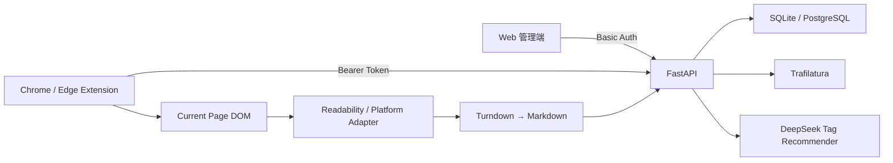

<div align="center">

# 🔖 URL Bookmark

**保存的不只是一串 URL，而是当时真正值得留下的网页内容。**

一个支持 **Web 管理 + Chrome / Edge 浏览器采集** 的个人网页收藏与轻量归档工具。

[简体中文](./README.md) | [English](./README.en.md)

[Online Demo](https://url-bookmark.onrender.com) | [AI 协作记录](./AI_NOTES.md)

</div>

---

## 项目简介

URL Bookmark 最初来自一个简单需求：粘贴网址，保存标题和正文，以后还能通过标签和搜索重新找到它。

真实使用中很快会遇到更多问题：有些网站拒绝服务器请求，JavaScript 动态页面返回的 HTML 中没有正文，登录后内容对用户可见但服务器看不到；即使正文抓取失败，用户仍然希望先保存这个网址。

因此，项目最终形成三个明确职责：

```text
Extension = Capture
Web       = Organize
Backend   = Store + Extract
```

> **Bookmark 是核心实体，Markdown 是增强内容。抓取失败不等于收藏失败。**

## 核心功能

### 网页收藏

- Web 端粘贴 URL 即可抓取；
- 自动获取标题，提取正文并保存为 Markdown；
- 用 `success`、`fetch_failed` 和 `extract_failed` 记录抓取状态；
- 抓取失败时仍保存 URL、标题、标签和备注；
- 支持重新抓取；
- 重复 URL 检测，命中后复用现有记录并允许修改标签和备注。

### 浏览器扩展

Chrome / Edge Manifest V3 扩展支持：

- 打开弹窗后自动读取当前页面；
- `activeTab + scripting` 按需注入提取脚本；
- 从已渲染 DOM 中提取动态或登录后内容；
- Readability 识别正文，Turndown 转换 Markdown；
- 无正文时仍可只保存 URL；
- 多选标签、新建标签和可选备注；
- 弹窗显示最近三条收藏，可打开详情或移入回收站；
- `Cmd/Ctrl + Shift + S` 快速保存到 `Inbox`。

### 标签与 AI 推荐

- 复用已有标签，也可在多选菜单第一行新建标签；
- DeepSeek 基于标题和 Markdown 生成推荐；
- 优先匹配已有标签，只建议少量新标签；
- 推荐不会自动成为正式标签，需要用户点击选中；
- AI 服务失败不会阻断收藏。

Web 和扩展会在正文提取成功后自动请求推荐，结果只显示在标签下拉菜单中。这意味着扩展提取的标题和 Markdown 片段会自动发送给后端标签推荐服务，但在用户点击“收藏”前不会写入 Bookmark。

### 搜索、整理与删除

- 按标题、URL 和 Markdown 正文搜索；
- 输入时防抖实时筛选，无需再点搜索；
- 按标签和来源平台组合筛选；
- 按加入时间、最近修改、平台 A→Z / Z→A 排序；
- 卡片 / 列表视图切换；
- 安全渲染 Markdown 详情，支持备注维护；
- 首页软删除和二次确认；
- 30 天回收站，支持恢复和彻底删除。

## 两种正文采集方式

### 1. Server Capture

Web 端默认使用：

```text
URL → 安全校验 → httpx → Trafilatura → Markdown → Database
```

适合博客、文档、新闻文章和普通公开 HTML 页面。提取器先使用偏精确模式，无结果时改用偏召回模式，再失败则回退到页面简介或仅保存 URL。

### 2. Browser Capture

扩展读取用户当前已渲染的 DOM：

```text
当前 DOM → Clone + 敏感节点清理 → 平台适配 / Readability
         → Turndown → Markdown → FastAPI
```

两种来源由 `capture_method = server | browser` 明确区分。Browser Markdown 存在时，后端直接保存，绝不再调用 Trafilatura 覆盖它；没有正文时仍会创建 `extract_failed` Bookmark。

## 平台适配

普通页面使用 Readability。针对非标准文章型页面，当前还提供轻量适配：

- **小红书**：标题、作者、笔记正文和最多 9 张图片；
- **YouTube**：标题、频道、简介、封面和原始观看链接；
- **Reddit**：标题、作者、Subreddit、正文和帖子图片。

```text
Platform Adapter → Readability → URL-only Fallback
```

YouTube 服务器抓取优先使用公开 oEmbed 元数据，避免直接访问 watch 页时常见的 HTTP 429。项目不下载视频；图片也只作为远程 URL 写入 Markdown，不是完整网页快照。

## AI 标签推荐

模型输入为网页标题、已有标签列表和 Markdown 前 4,000 字符，并必须返回结构化 JSON：

```json
{
  "existing_tags": ["Python", "AI"],
  "new_tags": ["FastAPI"]
}
```

服务端会再次去重和限制长度：总推荐最多 5 个，新标签最多 2 个，优先复用已有标签。模型输出只是候选，不会直接改变用户的分类体系。

## Architecture



| 领域 | 技术 |
| --- | --- |
| Backend | Python, FastAPI, SQLModel, Jinja2 |
| Storage | SQLite（本地）、PostgreSQL / Supabase（部署） |
| Server Extraction | httpx, Trafilatura |
| Browser Extraction | Mozilla Readability, Turndown |
| Markdown | markdown-it-py（禁用原始 HTML） |
| Extension | Chrome Manifest V3 |
| AI | DeepSeek API |
| Deployment | GitHub → Render, Supabase PostgreSQL |

## 安全与隐私

### SSRF 防护

- 只允许 HTTP / HTTPS，拒绝 URL 中的用户名和密码；
- 拦截 localhost、私有 IP、loopback、link-local 和 reserved 地址；
- DNS 解析后检查目标 IP，每次重定向后重新校验；
- 最多 5 次重定向、8 秒超时、5 MB 响应体，拒绝非 HTML 内容；
- 允许公开域名在本地代理下解析到 `198.18.0.0/15` Fake-IP，但拒绝直接输入该 IP。

### Browser Capture 隐私边界

扩展先 clone 当前 DOM，再从副本中删除 `script`、`style`、`form`、`input`、`textarea`、`select`、`button`、`contenteditable`、`iframe`、`video` 和 `audio` 等节点，不修改真实页面。

扩展不读取 Cookie、localStorage、sessionStorage、密码、表单值、Authorization 或浏览历史。Manifest 使用 `activeTab + scripting`，不申请永久 `<all_urls>` 页面读取权限。

### Web / Extension 认证分离

```text
Web       → Basic Auth
Extension → Bearer Token
```

扩展不保存 Web 主密码。Token 明文只在生成时显示一次，数据库只保存 SHA-256 Hash；重新生成会立即使旧 Token 失效。

## 数据持久化与 Migration

本地默认使用 `data/bookmarks.db` SQLite，部署环境使用 PostgreSQL / Supabase，使数据与 Render 应用实例分离。

项目使用轻量版本化 `schema_migrations`：每个 migration 有独立版本号，按顺序且只执行一次，DDL 和版本记录在事务中执行，同时兼容 SQLite 和 PostgreSQL。当前是单用户、单实例应用，因此没有为了工具完整性强行引入 Alembic。

## 项目结构

```text
.
├── app/
│   ├── main.py / models.py / schemas.py
│   ├── database.py / migrations.py / auth.py
│   ├── services/
│   ├── templates/
│   └── static/
├── extension/
│   ├── manifest.json
│   ├── popup.html / popup.js / capture.js
│   ├── background.js / options.html / options.js
│   └── vendor/
├── tests/
├── data/
├── AI_NOTES.md
├── README.md
└── README.en.md
```

## Quick Start

推荐 Python 3.11+。

```bash
git clone https://github.com/nancyxieyy/url-bookmark.git
cd url-bookmark
python3 -m venv .venv
source .venv/bin/activate
python -m pip install -r requirements.txt
cp .env.example .env
uvicorn app.main:app --reload
```

Windows 启用虚拟环境：

```powershell
.venv\Scripts\activate
```

访问 [http://127.0.0.1:8000](http://127.0.0.1:8000)。

### 环境变量

```env
# 可选：不配置则 Web 不启用 Basic Auth
APP_USERNAME=admin
APP_PASSWORD=replace-with-a-long-random-password

# 可选：不配置则仅禁用 AI 推荐
DEEPSEEK_API_KEY=replace-with-a-deepseek-api-key
DEEPSEEK_MODEL=deepseek-v4-flash

# 可选：留空则使用 SQLite
DATABASE_URL=
```

## 安装浏览器扩展

1. 打开 `chrome://extensions` 或 `edge://extensions`。
2. 开启“开发者模式”，点击“加载已解压的扩展程序”。
3. 选择项目中的 `extension/` 目录。
4. 登录 Web 管理端，在右上角“设置”生成 Extension API Token，并立即复制。
5. 打开扩展“设置”，填写 Server URL 和 API Token。
6. 打开任意 HTTP/HTTPS 网页，点击扩展图标即会自动采集。

扩展默认连接 `https://url-bookmark.onrender.com`。如改用其他服务器，保存设置时会请求该具体 origin 的访问权限。

## 部署

`render.yaml` 定义了 Render Web Service：

```text
Build:  pip install -r requirements.txt
Start:  uvicorn app.main:app --host 0.0.0.0 --port $PORT
Health: GET /health
```

推送到 GitHub 绑定分支后，Render 会自动构建和部署。生产数据库使用 Supabase PostgreSQL，密钥和连接串应只保存在 Render Environment Variables 中。

## Tests

```bash
pytest -q
```

当前验收记录：

```text
29 passed
```

覆盖 Bookmark CRUD、抓取成功/失败、URL 安全校验、SSRF、Markdown 渲染、标签、AI 输出清洗、重复检测、回收站、平台识别、Migration、Basic/Bearer 认证、Browser Capture 分流和 Extension Manifest。

真实 Chromium 验收：

```bash
python -m pip install -r requirements-dev.txt
playwright install chromium
uvicorn app.main:app --port 8765

# 另一个终端
python tests/browser_smoke.py
python tests/ai_tag_browser_smoke.py
python tests/extension_smoke.py
```

Smoke tests 包括 Web 交互、AI 推荐、未打包扩展、普通文章、JS 渲染页面、URL-only 回退、Token 失效、AI 失败降级以及小红书 / YouTube / Reddit 采集。

## 关键设计演进

| 最初方案 | 问题 | 当前方案 | 改进 |
| --- | --- | --- | --- |
| 抓取失败则收藏失败 | 外部网站不稳定会让 URL 丢失 | Bookmark 与 Markdown 分离 | 核心收藏链路更可靠 |
| 输入 URL 后跳转编辑页 | 操作被打断 | 首页草稿抓取后原地确认 | 采集、标签和收藏连成一条流程 |
| 只有服务器抓取 | 登录后和 JS 页面抓不到 | Browser DOM Capture | 保存用户实际看到的正文 |
| Browser Markdown 再走服务器抓取 | 可能用空页覆盖正确内容 | `capture_method` 明确分流 | 正文来源稳定可追踪 |
| 全部使用 Readability | 媒体平台不是标准文章 | 轻量平台适配 + 通用回退 | 改善小红书、YouTube、Reddit 效果 |
| YouTube 直接下载 watch 页 | 云端常见 HTTP 429 | oEmbed / 浏览器元数据 | 更稳定且不伪装成文章 |
| 逗号分隔手输标签 | 重复、拼写不一致 | 多选下拉 + 第一行新建 | Web 和扩展交互统一 |
| AI 独立模块和按钮 | 多一步且占用空间 | 自动生成并放进标签菜单 | 更少摩擦，仍由用户决定是否选中 |
| 永久删除 | 易误删 | 30 天回收站 | 可恢复 |
| 扩展保存 Web 密码 | 权限过大且难以撤销 | 独立 Bearer Token | 不暴露主密码 |
| Render 上使用 SQLite | 实例重建可能丢数据 | Supabase PostgreSQL | 数据与部署生命周期分离 |
| 启动时零散补字段 | 无法明确 Schema 版本 | `schema_migrations` | 升级顺序可验证、可重复 |

## AI Collaboration

ChatGPT 主要用于需求拆解、产品规则、异常场景和 Scope 取舍；Codex 用于 FastAPI / SQLModel 实现、浏览器扩展、Migration、测试、Bug 修复和文档。

```text
定义问题 → 拆分任务 → AI 实现 → 真实运行 → 测试 → 根据结果修正
```

典型人工校正包括：将抓取失败与收藏失败分离，防止 Browser Markdown 被服务器覆盖，分离 Web Basic Auth 和 Extension Bearer Token，修正本地代理 Fake-IP 导致的公开网站误拦截，并将零散数据库字段补丁改为版本化 migration。更完整的决策与验证记录见 [AI_NOTES.md](./AI_NOTES.md)。

## 主动控制的范围

项目没有为展示复杂度而加入 React、多用户账号、Redis、Celery、Elasticsearch、Vector Database、RAG、Knowledge Graph、AI Summary、云端 Playwright 抓取或付费墙绕过。当前优先保证：

```text
收藏 → 提取 → 保存 → 整理 → 重新找到
```

## Known Limitations

1. 当前不是完整网页镜像，只保存 Markdown；
2. 图片使用原站远程 URL，原图失效后可能无法显示；
3. 不保存视频文件、字幕或自动转录；
4. 平台 DOM 更新可能影响小红书、YouTube 和 Reddit 适配器；
5. AI 标签依赖 DeepSeek API，不可用时回退为手动标签；
6. 登录墙、付费墙和验证码不会被绕过；
7. Render 免费实例休眠后，首次访问可能较慢；
8. 草稿和回收站清理由访问触发，没有后台 Worker；
9. 当前是单用户应用，没有多账号数据隔离；
10. 快捷键保存到 Inbox 走 Server Capture，不执行 Popup 的 Browser Capture；
11. 当前没有 Snapshot、图片归档、版本历史、向量搜索或失效链接监控。

## Future Work

- JSON / Netscape Bookmark HTML 导入导出；
- 标签重命名和合并；
- 分页与更可靠的 URL canonicalization；
- Markdown 人工修正；
- 网页快照、图片本地归档和内容版本历史；
- 失效链接检测。

## License

This project was created as a take-home assignment and personal learning project. Add an explicit license before redistributing it as open source.
